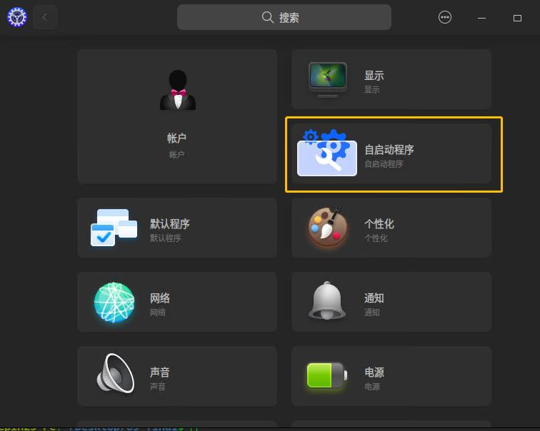
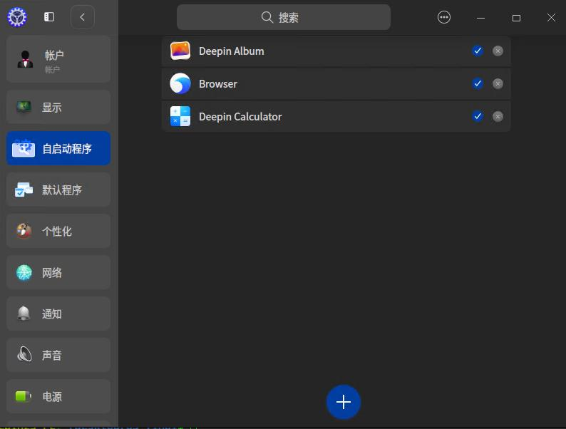
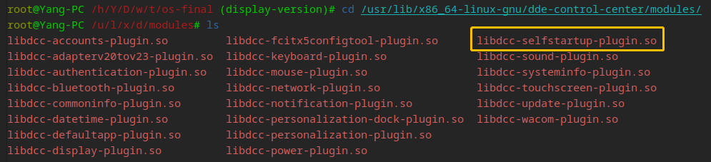

# DDE 控制中心自启动管理插件

DDE 控制中心自启动管理插件可单独编译、集成至 DDE 控制中心、集中展示并管理`Deepin`系统中软件开机自启动设置。

## 参赛信息

本项目参加2023全国大学生计算机系统能力大赛操作系统设计赛-功能挑战赛，选题为[proj223-control-center-startup-management-plugin](https://github.com/oscomp/proj223-control-center-startup-management-plugin)。

参赛小组：

- 复旦大学 朱元依
- 复旦大学 沈扬
- 复旦大学 朱俊杰

指导老师：

- 复旦大学 张亮
- 复旦大学 陈辰
- 企业导师 王子冲

## 完成情况

**【TODO】**项目文档位于根目录的`初赛报告.md`。\
博客地址：https://y-aang.github.io （题目：DDE 控制中心自启动管理插件）

| 任务                                                         | 完成情况                       |
| ------------------------------------------------------------ | ------------------------------ |
| （必须）完成一个控制中心插件，能够展示当前所有开机启动项的列表 | 完成                           |
| （必须）插件以单独的仓库提供，并能够单独构建，不需要合并入 dde-control-center 项目 | 完成                           |
| （必须）能够在插件中，通过用户界面的交互来管理（添加、删除、启用、禁用）开机启动项 | 完成                           |
| （必须）编写博客，记录开发过程的心得与体会，并将博客投递至 planet.deepin.org | 完成博客编写，待deepin官方审核 |

## 成果展示

功能展示视频链接：**【TODO】**

链接：https://pan.baidu.com/s/1-9B3n-61Sh7Jaq4SKp4WSw?pwd=hoo8 
提取码：hoo8 

插件图标：



自启动管理窗口：



添加自启动应用选择界面：


## 部署方式

### 1、系统环境

开发环境：Deepin V23Beta版

系统架构：x86

镜像下载链接：https://mirrors.ustc.edu.cn/deepin-cd/releases/23-Beta/

虚拟机平台：WMware Workstation 16Pro

操作系统环境搭建参考博客：https://blog.csdn.net/qq_44133136/article/details/105887560

### 2、配置 Deepin 插件环境

**安装依赖包：**

```shell
sudo apt build-dep .
sudo apt install -y qt5-default
sudo apt-get install dde-control-center-dev
```

### 3、安装插件

```shell
sudo sh shell.sh
```

安装成功后，打开控制中心，会看到以下自启动插件图标，即为安装成功：


此时，如果进入`/usr/lib/x86_64-linux-gnu/dde-control-center/modules/`文件夹，看到编译出的`.so`文件已经被下载到该文件夹中：



## 分工

朱元依：插件前端开发

沈扬：环境配置，编写配置文件

朱俊杰：后端接口开发（添加、删除、启用、禁用）

## 开发计划

### 第一步（4/9～4/18）

- [x] 调研`Deepin`、`dde-dock`、`QT`框架等相关内容
- [x] 设计项目方案
- [x] 分工

### 第二步（4/19～5/2）

- [x] 搭建主体插件类的框架
- [x] 设计启动项管理窗口的前端展示页面

### 第三步（5/3～5/13）

- [x] 开发部件类接口
- [x] 完善插件类功能

### 第四步（5/14～5/21）

- [x] 插件类右键功能开发
- [x] 完成配置文件

### 第五步（5/22～5/31）

- [x] Debug
- [x] 撰写文档

**（以上DDE-Dock自启动插件开发均在初赛完成，项目地址见末尾）**

### 第六步（6/26～7/8）

- [x] 调研`DDE Control Center`框架等相关内容
- [x] 设计前端界面
- [x] 分工

### 第七步（7/9～7/15）

- [x] 编译教程中的`Hello World`控制中心插件
- [x] 设计插件架构

### 第八步（7/16～7/22）

- [x] 配置环境，编译V20示例插件
- [x] 设计后端接口
- [x] 修改`window`、`operation`、`category`下的文件

### 第九步（7/23～7/29）

- [x] 配置环境，编译`Default-App`与`Self Start-up`插件
- [x] Debug

### 第十步（7/30～8/10）

- [x] 修改翻译、文字颜色问题
- [x] 撰写文档

## 参考资料

### 文档

Qt 插件标准：https://wiki.qt.io/Plugins

deepin V23 `dde-control-center`文档：[dde-control-center: dde-control-center (linuxdeepin.github.io)](https://linuxdeepin.github.io/dde-control-center/index.html)

`dde-control-center`控制中心插件开发示例：[控制中心插件 - deepin开发者平台](https://docs.deepin.org/info/开发入门/基础环境/DTK/案例/案例/控制中心插件)

`qt-5`手册：https://doc.qt.io/qt-5/

deepin 应用自启动说明：https://specifications.freedesktop.org/autostart-spec/autostart-spec-latest.html

### 博客

关于`deepin`开机自启动项的讨论：https://bbs.deepin.org/zh/post/169824、https://blog.csdn.net/qq_21137441/article/details/124825726

### 仓库

`dde-control-center`仓库：https://github.com/linuxdeepin/dde-control-center.git

其他开发者的插件项目：https://github.com/linuxdeepin/dde-network-core/tree/master

## 补充：DDE-Dock插件

除控制中心自启动插件外，我们还编写了DDE-Dock自启动插件，将自启动管理功能集成入DDE-Dock中，提供更为轻便快捷的管理界面。

项目地址：https://github.com/PinappleUnderTheSea/os223.git