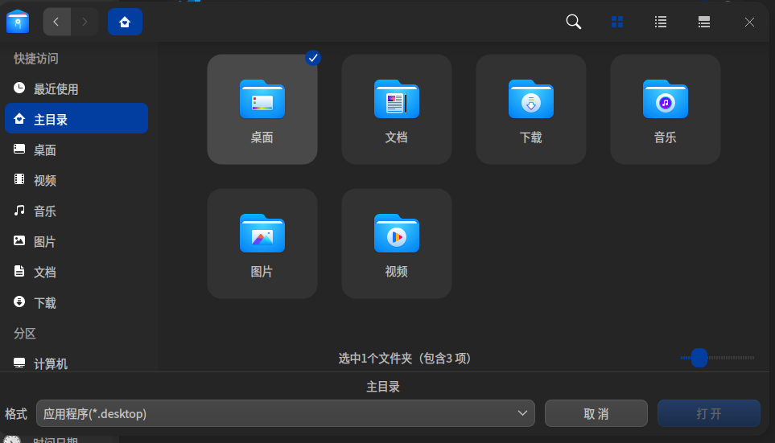

# DDE控制中心自启动插件 项目文档

队员：复旦大学 朱元依、沈扬、朱俊杰
指导老师：张亮、陈辰
企业导师：王子冲

[toc]


## 1 摘要

`Deepin`(原名`Linux Deepin`)致力于为全球用户提供美观易用，安全可靠的`Linux`发行版。该系统由深度科技自主开发，提供了美观易用、极简操作的桌面环境，主要由桌面、启动器、任务栏、控制中心、窗口管理器等组成。其中，控制中心是`Deepin`桌面环境的核心组件之一，它是用于管理和配置操作系统各种设置的集成工具。然而，在该控制中心中，并未对用户提供自启动项提供的便捷管理界面。在本项目中，我们为`Deepin`操作系统中自启动项的修改功能编写了简洁易用的控制中心插件，将自启动管理的系统功能集成到了控制中心中。该插件以单独的仓库提供，并能够单独构建，一键植入`Deepin`控制中心中。

## 2 需求分析

最终用户对自启动权限的管理目前只能通过`dde-launcher`（启动器/“开始菜单”）的右键菜单进行管理，而控制中心作为控制系统的门户应用反而缺少此功能。

**用户需求**

在官方发布的`deepin23-Beta`版本中，对于用户程序与系统程序的自启动管理方法为：找到应用的可执行程序（通常为.desktop）类型的文件，通过右键打开功能菜单的方式设置为开机自启动。但由于操作系统自带的应用程序界面中所有程序都会被展示到，所以当操作系统中应用程序过多的时候用户很难统计到那些程序被设置成了开机自启动，同时对于用户不想参与管理的应用也会展示在应用菜单中。因此我们对于本项目开发所面向的需求是在控制中心（deepin-control-center）中在不影响原有插件所提供的设置服务的基础上，为用户提供一个额外的插件用于管理开机自启动软件，同时插件可以满足用户自行选择需要手动维护的自启动程序，对于用户希望自己管理是否自启动的软件显示在面板上可以对是否自启动进行开关，用户不希望管理的软件默认不自启动不显示到面板；面板也可以提供添加和删除的功能让用户挑选出自己想要在面板上操作的应用。

**功能需求**

deepin作为国产开源的深度Linux桌面系统，不仅为用户提供了人性化、个性化以及对于中文等语言有良好支持的操作系统体验，也为Linux的开发者与学习者提供了控制中心（dde-control-center）与任务栏（dde-dock）等桌面控件的开发者接口与插件注入接口。除了可以不断的扩展完善用户需求与用户体验外，deepin深度桌面在操作系统学科的教学与深入理解方面也带来了很多的可能性与创造性。因此作为OS大赛的参与团队，我们不仅是在希望我们的开发会对deepin项目的完整性、deepin用户的体验感上带来一些帮助，同时也想通过我们自己的努力在学生的视角让操作系统的教学与后续学习有一个优秀的案例和一些开发相关的经验总结，使得我们理论层面的操作系统教学可以有更大的实践空间。

### 2.1 当前方案

目前已有的自启动管理方法是在开始菜单中对菜单中所展示应用软件单独进行自启动的设置。具体的方法是对所希望设置自启动项的应用软件选中后右键，点击“设置开机自启动”即可在每次开机时自动打开该应用软件。


然而，这种方法有两大明显的缺陷：（1）无法向用户展示所有的自启动项设置（2）大批量的自启动项修改极其不便。由此，催生了控制中心自启动管理插件的需求。

### 2.2 插件需求

为了完成控制中心插件，我们对需求进行了更细致的刻画。经过总结后，插件的需求主要分为三条：

1、完成一个控制中心插件，能够展示当前所有开机启动项的列表；
2、能够在插件中，通过用户界面的交互来管理（添加、删除、启用、禁用）开机启动项；
3、插件以单独的仓库提供，并能够单独构建，不需要合并入 dde-control-center 项目。

其中，第一条需求是该插件的基础。自启动项的列表一方面为用户提供了清晰的展示界面，另一方面也是程序与用户交互，获取修改操作信息的基础。
第二条需求总结了该插件需要支持的功能，即添加、删除、启用、禁用，这些功能需要在前端设计对应的交互界面，同时在后端设计对应的操作接口，调用系统接口以修改自启动设置。
第三条需求与系统发布相关。目前最新的稳定发布版本是`Deepin V23 Beta`，而官方版本已经在发布，若修改源码统一编译控制中心，会需要对当前已发行的操作系统版本进行修改，较为不便。故需要单独编译该插件，并将其装载到系统中的插件接口中。

## 3 相关资料调研

### 3.1 Deepin开机自启动系统设置

`Deepin`系统通过检测固定的目录，检测自启动项。通过放置应用程序的`.desktop`文件在其中一个自动启动目录中，系统可以检测到该应用程序的自启动设置。通过修改`.desktop`文件中的对应字段，可以修改对应应用程序的自启动设置。

#### 3.1.1 自启动目录

在["desktop base directory specification"](http://standards.freedesktop.org/basedir-spec/)中的["Referencing this specification"](http://standards.freedesktop.org/basedir-spec/basedir-spec-latest.html#referencing) 部分进行定义了自动启动目录是 `$XDG_CONFIG_DIRS/autostart`。

如果同一文件名位于多个自动启动目录下，只应使用最重要目录下的文件。

示例：

如果未设置`$XDG_CONFIG_HOME`，用户主目录中的自动启动目录为`~/.config/autostart/`。

如果未设置`$XDG_CONFIG_DIRS`，系统范围的自动启动目录为`/etc/xdg/autostart/`。

如果未设置`$XDG_CONFIG_HOME`和`$XDG_CONFIG_DIRS`，并且两个文件`/etc/xdg/autostart/foo.desktop`和 `~/.config/autostart/foo.desktop`存在，那么只有文件`~/.config/autostart/foo.desktop`将被使用，因为`~/.config/autostart/`比`/etc/xdg/autostart/`更重要。

#### 3.1.2 应用程序的`.desktop `文件

一个应用程序的`.desktop`文件必须符合"桌面入口规范"中定义的格式。所有关键字应按照定义进行解释，但以下情况除外，以便考虑到位于自动启动目录中的`.desktop`文件不会显示在菜单中。

##### `Hidden`关键字

当`.desktop`文件的`Hidden`关键字设置为`true`时，该`.desktop`文件必须被忽略。当多个具有相同名称的`.desktop`文件存在于多个目录中时，仅应考虑最重要的`.desktop`文件中的`Hidden`关键字：如果其设置为`true`，则其他目录中具有相同名称的所有`.desktop`文件也必须被忽略。

##### `OnlyShowIn`和`NotShowIn`关键字

`OnlyShowIn`项可以包含一个字符串列表，用于标识必须自动启动此应用程序的桌面环境，其他桌面环境不得自动启动此应用程序。

`NotShowIn`项可以包含一个字符串列表，用于标识不得自动启动此应用程序的桌面环境，其他桌面环境必须自动启动此应用程序。

这两个关键字中的一个，要么是`OnlyShowIn`，要么是`NotShowIn`，可以出现在单个`.desktop`文件中。

##### `TryExec`关键字 

带有非空`TryExec`字段的`.desktop`文件如果`TryExec`关键字的值与已安装的可执行程序不匹配，则不得自动启动。`TryExec`字段的值可以是绝对路径，也可以是没有任何路径组件的可执行文件名。如果指定了没有任何路径组件的可执行文件名，则会搜索`$PATH`环境以找到匹配的可执行程序。

##### 注意事项 

如果通过在系统范围的自动启动目录中安装`.desktop`文件来自动启动应用程序，则个人用户可以通过在其个人自动启动目录中放置具有相同名称的`.desktop`文件来禁用此应用程序的自动启动，并在其中包含`Hidden=true`关键字。

### 3.2 控制中心插件开发

##### V23控制中心特性

1、V23控制中心只负责框架设计，具体功能全部由插件实现；
2、V23控制中心支持多级插件系统，支持插件插入到任意位置中；
3、高度可定制，可定制任意插件是否显示，若插件支持，可定制任意插件内容是否显示。

##### V23控制中心插件安装路径说明

1、控制中心会自动加载翻译，翻译目录需要严格放置在`/${CMAKE_INSTALL_PREFIX}/${CMAKE_INSTALL_DATAROOTDIR}/dde-control-center/translations`下，控制中心会自动加载，同时，插件的翻译和名称也有要求，命名为`${Plugin_name}_{locale}.ts`，`locale`就是多语言的翻译，翻译文件必须控制和插件名称相同；
2、控制中心的so应该放置在`/${CMAKE_INSTALL_PREFIX}/${CMAKE_INSTA；LL_LIBDIR}/dde-control-center/modules`下，请使用构建系统的提供的`gnuinstall`路径，上面举的例子是`cmake`，`mesonbuild`也有自己的逻辑。

##### V23控制中心开发接口说明

1、`ModuleObject`类用于构建每个页面元素，其是插件的核心；
2、`PluginInterface`类用于规范插件信息，每个插件必须提供一个`ModuleObject对象。

##### 标准开发流程示例

1、继承`PluginInterface`，实现其虚函数；
2、实例化一个根模块，根模块在初始化时不允许有耗时操作，若有耗时操作，应继承`ModuleObject`然后实现`active`方法，将耗时操作放入其中；
3、若根模块的子项是横向菜单列表，则可使用`List`储存其基础信息，继承或使用`HListModule`类，然后循环使用`appendChild`方法将菜单添加到根模块中；
4、若根模块的子项是纵向菜单列表，则可使用`List`储存其基础信息，继承或使用`VListModule`类，然后循环使用`appendChild`方法将菜单添加到根模块中；
5、以此类推，具体的某个子项菜单同样再次添加菜单列表，直到菜单列表的子项为`PageModule`时为止；
6、准备一个以上的`Module`继承自`ModuleObject`，并实现其`page()`方法，然后添加到`PageModule`中，注意，`page()`方法中需返回新的`QWidget`对象；
7、当某个菜单为`PageModule`时，使用其`appendChild`方法将上方的`Module`添加到其子项中，此时，控制中心会根据`page`的大小添加滚动条，并将多个`page`进行垂直排列进行显示。`PageModule`持支嵌套，并且其有默认边距，如果嵌套使用，嵌套的`PageModule`边距建议设置为0；
8、若某个`VListModule`或`PageModule`页面需要附加按钮时，可调其子项`ModuleObject`的`setExtra`，该`ModuleObject`的`page`提供按钮，这样该`ModuleObject`将显示在`VListModule`或`PageModule`页面的最下方。

## 4 系统框架设计

### 4.1 项目组织方式

#### 类图


#### 项目文件组织

详细文件树请见附录C

```bash
.
├── CMakeLists.txt
├── include
│   ├── interface
│   │   ├── ...
│   └── widgets
│       ├── ...
├── misc
│   ├── ...
├── shell.sh
├── src
│   ├── frame
│   │   ├── ...
│   ├── interface
│   │   ├── ...
│   ├── plugin-selfstartup
│   │   ├── operation
│   │   │   ├── ...
│   │   └── window
│   │       ├── ...
│   └── widgets
│       ├── ...
└── translations
    ├── ...(translation files)
    ├── desktop
        ├──...(desktop translation files)
```

### 4.1 总体思路与系统框架

#### 4.1.1文件框架思路

通过阅读dde-control-center的源代码，src部分为插件的实现以及实现代码复用所存在的框架代码，代码的插件部分在src/plugin-selfstartup目录，分为operation和window部分，其中windows部分主要负责控制中心自启动项目的界面构成，operation部分负责参与控制中心对系统文件与配置的控制。translation文件夹为控制中心（dde-control-center）提供了不同语言环境下的支持，通过识别系统的语言环境选择展示到面板不同的语言。include与misc为项目注册到控制中心所必须包含的编译依赖文件。

#### 4.1.2 设计思路

我们在初赛中已经完成了通过注册到dde-dock实现的自启动插件，对于插件的界面以及界面上按钮对应的功能已经有了一个大致的构想，但由于dde-dock的插件是一个较为独立的结构，而dde-control-center里面的每一个插件都需要往控制中心里注册一个module并且通过rpc方法与dde-application-manager进行远程服务的交流，因此在实现细节上dde-control-center插件和dde-dock插件有着很大的区别。

用户逻辑方面，我们首先在控制中心实现了管理自启动应用的面板，对于添加到维护列表的应用都会被展示到面板上，对于每一项应用都会提供`Enable/Disable`的选择按钮和`Delete`的删除按钮，用于管理是否开机自启动与不希望维护改应用的删除。同时在面板有一个添加按钮，用户点击后会打开文件对话框，用户可以自行从中选择自定义路径的应用程序添加到插件维护的列表中。

插件运行逻辑方面，分别有添加、删除、开启/关闭（反转）逻辑，分别思路如下：

- 添加逻辑：用户在点击添加按钮后会获取该文件的路径并读取`FileInfo`，`AddButtonWidget`发送`requestCreateFile`信号携带参数`Category`名称与`FileInfo`到`Worker`中；`Worker`在`/home/user/.config/autostart`文件下判断是否存在一个相同的应用信息，如果不存在则创建一个原`.desktop`文件的副本并且添加一行`Hidden=false`字段，把应用信息存到App结构体中，同时调用`Worker`中对应的`Category`的添加函数传入赋值好的App，`Category`在内存中同步一份自启动应用信息，最后更新前端页面。
- 删除逻辑：在用户点击应用对应行的删除按钮后获取到`AppID`，通过`getAppById`得到App信息后发送`requestDelUserApp`信号到`Worker`，`Woker`找到`autostart`文件夹中对应文件并将其删去，同时把App在对应的`Category`中移除，最后更新前端页面。
- 反转逻辑：在用户点击对应行的打勾按钮后想获取到AppId，通过`getAppById`得到App信息后发送反转请求到`Worker`，`Worker`读取磁盘中`autostart`里对应`.desktop`文件文本找到`Hidden`字段并将其反转，同时调用`Category`把内存中App结构体的`Hidden`成员反转，最后更新前端页面。
- 启动逻辑：插件启动的时候会调用`Category`的`getAppItem`函数，该函数从`autostart`文件夹中逐文件读取信息存在App结构体中，封装到`m_appList`作为初始化时参与维护的应用程序，前端从`m_appList`中把应用名称以及是否自启动信息列举到页面

### 4.2 类功能说明

##### operation部分

```
├── defappmodel.cpp
├── defappmodel.h
├── defappworker.cpp
├── defappworker.h
├── mimedbusproxy.cpp
├── mimedbusproxy.h
└── qrc
```

operation部分是插件的后端部分，对于控制中心的每个插件都有`Model`，`Worker`和`DBusProxy`三个部分：

- `Model`：`Model`部分通过继承`QObject`注册到QT的项目中，私有变量`Category`实现了自启动信息在内存中的一个副本用于前端的交互。
- `Worker`：`Worker`部分提供了插件对文件系统的操作。由于操作系统对于开机自启动的支持在于把对应的`.desktop`文件拷贝到`/home/user/.config/autostart`中并设置`Hidden=false`，因此对于自启动应用管理的插件必须要对文件的读写提供支持，该支持由`Woker`部分实现。
- `DBusProxy`：由于插件要注册到控制中心并且对应用进行管理，因此需要向运行中的应用程序管理服务（`dde-application-manager`）进行交互，管理服务提供了rpc的调用接口，插件通过`DBusProxy`部分向管理服务发起远程请求。

##### window部分

```
├── selfstartup.json
├── selfstartup.cpp
├── selfstartupdetailwidget.h
├── selfstartupplugin.cpp
├── selfstartupplugin.h
└── widgets
    ├── addbuttonwidget.cpp
    ├── addbuttonwidget.h
    ├── category.cpp
    └── category.h
```

`window`部分是插件的前端部分，由`Plugin`，`Detailwidget`，`Addbuttonwidget`和`Category`四个部分：

- `Plugin`：`Plugin`部分构造了自启动程序插件。包括插件接口的初始化，一级页面的初始化和二级页面的初始化。
- `Detailwidget`：`Detailwidget`部分构造了自启动程序插件的 `app`条目。包括`app`条目的外形、位置，`app`条目的增删改查操作，以及与`worker`和`model`的交互操作（通过信号和槽函数实现）。
- `Addbuttonwidget`：`Addbuttonwidget`部分构造了自启动程序插件的加号按钮。包括加号按钮的外形、位置，新增`app`的弹窗显示，新增`app`的路径处理，以及与`worker`和`model`的交互操作（通过信号和槽函数实现）。
- `Category`: `category`部分为磁盘中autostart文件夹中重要信息在内存中的拷贝，用于插件的窗口部分直接获取到该文件夹中.desktop类型文件的重要字段展示到界面。


### 4.3 实现描述

#### 4.3.1 DefAppModel

| 名称            | 功能                      |
| --------------- | ------------------------- |
| DefAppModel     | Model构造函数             |
| ~DefAppModel    | Model析构函数             |
| getModSelfSetUp | 返回SelfSetUp内存Category |

#### 4.3.2 DefAppWorker

| 名称                | 功能                                                         |
| ------------------- | ------------------------------------------------------------ |
| DefAppWorker        | Worker构造函数，连接Worker和Model                            |
| DefaultAppsCategory | 枚举类，用于实现插件的可扩展性，实现对不同类型软件的分类，默认状态为只有SelfSetUp类 |
| active              | 向应用程序管理服务发出blockSignal(false)消息                 |
| deactive            | 向应用程序管理服务发出blockSignal(true)消息                  |
| onReverseUserApp    | 对参与维护的自启动应用开关反转处理，把autostart中的.desktop文件Hidden字段反转并同步Category |
| onGetListApps       | 与Model处理应用变化信号结束的信息提供的一个空接口，只用于承接信号处理 |
| onDelUserApp        | 在autostart文件夹中删去用户不希望继续维护是否自启动的应用并同步Category |
| onAddUserFile       | 向autostart中添加用户希望维护是否自启动的应用并同步Category  |
| getCategory         | 返回应用类型的分类                                           |

#### 4.3.3 MimeDBusProxy

| 名称          | 功能                                    |
| ------------- | --------------------------------------- |
| MimeDBusProxy | DBusProxy构造函数。                     |
| DeleteApp     | 向应用程序管理服务发送删除App请求。     |
| AddUserApp    | 向应用程序管理服务发送添加用户App请求。 |
| ListApps      | 向应用程序管理服务发送展示所有App请求。 |
| Change        | 向应用程序管理服务发送App变动处理请求。 |

#### 4.3.4 SelfStartupDetailWidget

| 名称                     | 功能                                                         |
| ------------------------ | ------------------------------------------------------------ |
| SelfStartupDetailWidget  | 自启动软件条目窗口构造函数。初始化条目窗口中的文字不可编辑、icon大小、条目形状、条目不可移动，初始化存储软件列表的QStandardItemModel，初始化软件条目的布局。 |
| ~SelfStartupDetailWidget | 自启动软件条目窗口析构函数。                                     |
| setModel                 | 设置自启动软件条目窗口的当前model。根据当前窗口的分类，设置不同的窗口model（由于本插件目前只有一个分类，因此setModel功能相当于直接调用setCategory功能）。 |
| setCategory              | 设置自启动软件条目窗口的当前分类。将分类的增、删、改的信号和对应的自启动软件条目窗口的槽函数连接，将分类中的软件放入存储软件列表的QStandardItemModel中，并更新自启动软件条目窗口。 |
| updateListView           | 更新自启动软件条目窗口。依次读取自启动软件条目窗口的当前model中的每一个软件状态，依照软件状态，更新窗口显示（显示是否自启动、软件名称、软件icon、删除按键）。 |
| getAppIcon               | 获取软件的icon。从系统中获取软件的icon，并统一调整为32*32大小。 |
| getAppById               | 通过ID获取APP结构体。遍历分类中的app，返回对应的APP结构体。 |
| appendItemData           | 向model中新增app信息。从APP结构体中获取app信息，向model中新增app，并更新总app数量。 |
| isDesktopOrBinaryFile    | 判断文件是否属于桌面或二进制文件。 |
| isValid                  | 判断app是否有效。判断app的ID非空。 |
| reverseItem              | 向category发出app自启动状态转换的信号。 |
| requestDelUserApp        | 向category发出删除app的信号。 |
| onListViewClicked        | 自启动软件条目窗口被点击后的槽函数。从自启动软件条目窗口获取app信息，并向category发出app自启动状态转换的信号。 |
| onDelBtnClicked          | 自启动软件条目窗口删除按钮被点击后的槽函数。从自启动软件条目窗口获取app信息，并向category发出删除app的信号。 |
| onClearAll               | 清空model中所有的app信息。 |
| getAppListview           | 返回model中所有的app信息。 |
| AppsItemChanged          | 重置model中所有的app信息。依次将app_list中的app信息存入model中，并连接激活、点击信号。 |
| onReverseApp             | category返回app自启动状态转换信号的槽函数。更新对应model中app的自启动状态，并更新窗口。 |
| addItem                  | category返回app新增信号的槽函数。向model中新增对应的app信息，并更新窗口。 |
| removeItem               | category返回app删减信号的槽函数。向model中删减对应的app信息，并更新窗口。 |
| showInvalidText          | 设置自启动软件条目窗口的字体、图标的位置、大小。 |

#### 4.3.5 SelfStartupPlugin

| 名称              | 功能 |
| ----------------- | ---- |
| SelfStartupPlugin | 自启动程序插件的构造函数。基于DCC_NAMESPACE::PluginInterface的接口。 |
| name              | 返回自启动程序插件的名称。 |
| module            | 自启动程序插件初始化函数。初始化自启动程序插件的一级页面、二级页面和加号按钮。 |
| location          | 返回自启动程序插件的位置。即，在控制中心插件中的排序。 |

#### 4.3.6 SelfStartupModule

| 名称               | 功能 |
| ------------------ | ---- |
| SelfStartupModule  | 自启动程序插件一级页面的构造函数。初始化一级页面的名称，描述，图标，work，model。 |
| ~SelfStartupModule | 自启动程序插件一级页面的解构函数。向m_work、m_model发送删除信号。 |
| work               | 返回m_work。 |
| model              | 返回m_model。 |
| active             | 激活m_work。 |

#### 4.3.7 SelfStartupDetailModule

| 名称                    | 功能 |
| ----------------------- | ---- |
| SelfStartupDetailModule | 自启动程序插件二级页面的构造函数。初始化二级页面的名称，分类，work，model。 |
| page                    | 自启动程序插件二级页面的初始化函数。初始化DetailWidget，并将DetailWidget的app状态修改信号、删除信号与work的槽函数相连接。 |

#### 4.3.8 Category

| 名称            | 功能                                                         |
| --------------- | ------------------------------------------------------------ |
| Category        | Category类构造函数，继承QObject类，每个Category类里面封装相同类型的应用信息 |
| getName         | 获取当前Category分类的名称                                   |
| setCategory     | 设置当前Category的类型名称                                   |
| getappItem      | 获取当前Category封装的应用信息                               |
| clear           | 清空当前Category储存的应用信息                               |
| addUserItem     | 把传入应用信息存到Category中并向前端发送更新信号             |
| delUserItem     | 把目标应用从Category中删除并向前端发送更新信号               |
| reverseUserItem | 设置目标应用Hidden字段反转并向前端发送更新信号               |

 


## 5 系统测试情况

### 5.1前端测试

完成插件安装后，可在 DDE 控制中心中看到名为“自启动程序”的管理选项：


### 5.2 自启动管理功能测试

点击改图标，可以进入自启动管理界面：


该界面展示了设置所有的自启动项的软件，如果在软件右边出现了蓝色勾，则说明该软件设置了开机自启动。可以通过点击蓝色的勾取消开机自启动的设置，再次点击则可恢复。由此实现了自启动管理的开启、禁用功能。

底部的加号用于添加需要进行自启动管理的软件，点击后跳出选择窗口：



进入软件所安装的文件夹，选择该软件，即可将其添加入自启动管理中。在自启动管理界面中，可以点击软件右侧灰色的叉号，以将该软件剔除出自启动管理的界面。由此实现了自启动管理的添加、删除功能。

## 6 插件的可扩展性

本次项目的插件完整的覆盖了OSCOMP-proj223的所有需求，但由于只是一个短期开发的项目，因此有构想到了很多可以对插件进行扩展的方面；同时deepin作为开源社区也为开发者提供了良好的扩展接口，我们考虑了以下几点的扩展路径：

### 6.1 语言扩展

对于translation 板块，我们修改和编译仅仅使用了dde-control-center的zh_CN部分，限于语言广度我们只能提供插件的简体中文和英文模式，对于deepin可以支持的其他语言还有待扩展

### 6.2 用户体验扩展

由于Linux系统贯彻了"everything is a file"这一思想，因此整个操作系统的磁盘布局是文件化的，用户的应用可以安装到磁盘的任意地方，同时考虑到大部分Linux使用者为具有计算机基础能力的开发者，我们在插件中设计的添加应用按钮是让用户自主找到文件路径并添加。但是对于一般用户，这样的操作可能有些许复杂，所以我们考虑一个提高用户体验的方式：deepin中系统应用和从应用商店获取的用户程序分别分布在了两个文件夹中，如果用户没有自定义路径的话，我们的插件可以在用户请求添加的时候扫描这两个文件夹，提前给用户展示出可能用户希望添加的应用程序可供直接点击添加

### 6.3 实时性扩展

我们测试了dde-control-center的大部分插件，我们发现几乎所有都没有实现实时扫描磁盘的功能——即如果我们在dde-control-center外部对插件所管理的磁盘进行了修改的话，前端的界面并不会感受到更新而刷新界面。以自启动为例，我们实现了管理插件，但是用户仍然可以在应用菜单栏从控制中心外部添加到自启动中，此时自启动并不会更新页面，需要放回上一级窗口重新启动插件进行扫描。对于这一项扩展，我们考虑了一种方法为新起一个线程不停的扫描autostart文件夹中的.desktop文件并与Category中的比较，如果出现了不一致则发送（Q_Emit）更新窗口的信号，这样可以实现不返回上一级的情况下更新。但该功能只是作为扩展性的一个构想，实际实现的话首先带来的用户体验收益并不是很大，且已经存在插件的情况下应用场景很小，同时开启一个持续扫描的线程对于内存与插件的效率有较大的开销。

### 6.4 并发性扩展

插件的工作流程包含了修改磁盘与更新内存中的映射同时展示到面板上。对于磁盘的修改会涉及到一定次数的I/O，因此时间开销一定会比内存中信息更新更大的。因此我们思考了可以在此插件的基础上在新起一个进程，用rpc的方式对插件提供服务，服务内容包括对autostart文件夹的增删查改，插件只需要修改内存中的部分并作为rpc客户端向磁盘I/O的服务发送函数调用请求即可

### 6.5 一致性的扩展

因为插件会同时修改内存与磁盘的信息，并且保证二者相同，此时就会存在一定的一致性问题：

- 磁盘和内存写入不同步，在其中一个进行的过程中发生了崩溃程序退出，此时是否成功写入成为一个一致性问题。我们的解决方式为先写入磁盘再写入内存，同时在重启插件的时候会重新扫描一次磁盘，这样只要写入磁盘的第一阶段成功之后即使崩溃也可以在重启的时候恢复数据
- 多进程同时操作：如果有多个控制中心进程同时进行了文件的操作，采取的方式为读磁盘，写磁盘，写内存的操作，这样可以使得在读磁盘的时候如果有同名的应用被添加到里面会被正在写入（包括添加与删除操作）的进程阻塞读取，在写入过程结束之后才会触发读磁盘，然后写内存的时候判断是否存在，如果存在则跳过第三步，如果不存在则再写入磁盘


## 附录A 插件安装

### 1、开发环境配置

#### （1）、配置 Deepin 操作系统

开发环境：Deepin V23Beta版

系统架构：x86

镜像下载链接：https://mirrors.ustc.edu.cn/deepin-cd/releases/23-Beta/

虚拟机平台：WMware Workstation 16Pro

操作系统环境搭建参考博客：https://blog.csdn.net/qq_44133136/article/details/105887560

#### （2）、配置 Deepin 插件环境

**安装依赖包**：

```shell
sudo apt build-dep .
sudo apt install -y qt5-default
sudo apt-get install dde-control-center-dev
```

#### （3）、插件安装测试

##### 安装插件：

```shell
sudo sh shell.sh
```

安装成功后，打开控制中心，会看到以下自启动插件图标，即为安装成功：


此时，如果进入`/usr/lib/x86_64-linux-gnu/dde-control-center/modules/`文件夹，看到编译出的`.so`文件已经被下载到该文件夹中：


## 附录B 开发过程问题记录

### 1 开发环境配置问题

#### 1.1 Deepin V20 Beta与Deepen V20.9

在开发环境配置过程中，我们遇到了比较大的问题。

我们起初顺延初赛的思路进行开发，在`Deepin V20Beta`版中进行开发。我们完成相关依赖包的安装后可以顺利地编译我们所写的控制中心自启动插件。但我们发现安装插件后的控制中心只剩我们所编译的自启动插件。（如下图中仅剩测试编译的 Default Applications 和 Self Start-up 插件）


我们推测是因为系统自动配置的控制中心框架与网上的控制中心开源代码版本不同，导致插件安装后框架复写。故我们只需重新编译控制中心的代码重新安装至虚拟机系统中即可完成测试。

然而，在尝试编译控制中心时各种尝试均失败。报错DTK版本不符，未找出解决方法。在`Deepen V20.9`中亦未成功。

#### 1.2 Deepin V23Beta

在遇到上述问题后，我们加入了`Matrix`的Deepin开发者社区，在线上与其他开发者讨论我们所遇到的问题。

经过与其他开发者的讨论，我们得知最新的开源版本的控制中心已不再支持 20 版的Deepin系统。

于是我们重新安装最新版本的`Deepin V23Beta`，成功的将我们所编写的插件植入控制中心中。

### 2 图标与文字颜色展示问题

我们初步的demo展示出来的界面所有管理的应用程序都是统一显示的默认应用程序的图标，但我们还是希望要和deepin桌面上.desktop文件相同的图标；与此同时，我们发现发现插件中的应用程序名字都是红色，同时希望这里是一个经典的黑色，这两个都是关于item的展示问题。我们关注到了这一段代码：

```c++
QIcon icon = getAppIcon(iconName, QSize(32, 32));
act->setIcon(icon);
act->setTextColorRole(DPalette::TextTitle);
act->setIconText(name);
```

- 关于icon问题，我们可以对App结构体进行扩展，增加一条icon字段，通过读取带有图标应用程序.desktop文件中的icon字段存到当中，如果没有icon字段的程序设置为“application-default-icon”，并且在展示的时候调用`act->setIcon()`传入icon字段
- 关于颜色问题，上述代码中看到了`act->setTextColorRole()`字段，里面传入了文字颜色类型的变量，在DPalette中定义了如下常量，初始选择的红色文字为`TextWarning`，我们只需要替换为`TextTitle`即可

| TypeName       | 颜色类型                                                     |
| -------------- | ------------------------------------------------------------ |
| ItemBackground | 列表项的背景色                                               |
| TextTitle      | 标题型文本的颜色                                             |
| TextTips       | 提示性文本的颜色                                             |
| TextWarning    | 警告类型的文本颜色                                           |
| TextLively     | 活跃式文本颜色（不受活动色影响）                             |
| LightLively    | 活跃式按钮（recommend button）背景色中的亮色（不受活跃色影响） |
| DarkLively     | 活跃式按钮（recommend button）背景色中的暗色，会从亮色渐变到暗色（不受活跃色影响） |
| FrameBorder    | 控件边框颜色                                                 |
| NColorTypes    | 无颜色类型                                                   |

### 3 翻译问题

翻译主要涉及到：插件名的翻译和自启动软件名的翻译。

对于插件名的翻译。我们学习了`DDE-NETWORK-CORE`仓库的做法，首先我们编写翻译成不同语言的`.ts`翻译文件，使用`CMakelists`中的`qt5_add_translation`指令获得`.qm`翻译文件，再将翻译的`.qm`文件`install`进入`${CMAKE_INSTALL_DATAROOTDIR}/dde-control-center/translations`（通常是`$/usr/share/dde-control-center/translations`），在通过`loadTranslator`载入系统对应语言的翻译文件。

对于自启动软件名的翻译。考虑到部分软件缺失官方翻译名称，无法软件的信息中直接获取，我们目前只采用英文格式。

### 4 开机启动项处理思路问题

为了实现插件可视化管理软件的开机自启动，了解`Deepin`系统开机自启动的功能实现是至关重要的。

通过查阅资料与实践，我们了解到`Deepin`系统包含自启动文件夹`~/.config/autostart`，该文件夹类似于 Windows 下的启动文件夹，系统开机时会执行该文件夹下的每个 desktop 文件 Exec 参数指向的脚本或可执行文件。

为了确认可行性，小组进行了该方法的验证。首先，通过`Deepin`系统自带的修改开机自启动设置的方法，修改开机启动项（图中修改终端的自启动项）：


随后检查自启动文件夹`~/.config/autostart`：

```shell
yang@yang-PC:~/.config/autostart$ ls
deepin-terminal.desktop org.deepin.browser.desktop
```

发现`deepin-terminal.desktop`文件被添加入了该自启动文件夹中，并且会在开机时自启动。

而取消终端的自启动时，`~/.config/autostart`中已有的`deepin-terminal.desktop`文件并不会被移除，而是其中的`Hidden`的字段会被修改为`false`，表示取消开机自启动设置。

由此，可以通过在插件中检查所有`~/.config/autostart`文件夹中`.desktop`文件的`Hidden`字段来搜索系统所有的自启动软件；也可以通过添加`.desktop`文件、修改`Hidden`字段的方式进行开机自启动设置的修改。

### 5 rpc远程通信问题

1. **远程过程调用：** RPC允许一个程序调用另一个程序在远程机器或进程上执行的过程（函数或方法），就像本地调用一样。这样，开发者可以透明地在分布式系统中调用远程的功能，无需关注底层网络细节。
2. **通信协议：** RPC通信需要定义一个协议，该协议规定了消息的格式、编码方式、序列化和反序列化方法等。通过确定的request和response协议格式制定规定了客户端和服务器之间如何进行数据交换。
3. **序列化和反序列化：** 在RPC通信中，数据需要在网络上传输，因此需要将数据进行序列化（编码）以便在网络上传输，然后在接收端进行反序列化（解码）以还原数据。序列化和反序列化过程确保数据的正确传输和解释。
4. **数据传输：** RPC通信依赖底层的网络传输协议，如TCP或HTTP。客户端和服务器通过网络传输消息，以实现远程过程调用。
5. **错误处理：** RPC通信中需要处理各种可能的错误情况，例如网络连接中断、超时、服务不可用等。合理的错误处理可以保证系统的可靠性和鲁棒性。
6. **服务注册与发现：** 在dde-application-manager中以字符串命名注册了远程调用函数的服务，dde-control-center中关于对应用的变更可以通过rpc远程调用实现就和
7. **安全性：** RPC通信涉及跨网络的数据传输，因此安全性是一个重要考虑因素。加密、认证和授权等机制可以确保通信的安全性。

### 7 插件描述缺失问题


在加载插件后，我们发现插件缺失了描述信息，与其他的插件格式明显由很大的不同，通过`Matrix`上交流发现，是插件缺少了`setDescription`的代码，因此，正确加入描述后，我们获得了以下结果。


## 附录C 详细文件树

```bash
├── CMakeLists.txt
├── Report.md
├── build
├── include
│   ├── interface
│   │   ├── hlistmodule.h
│   │   ├── moduleobject.h
│   │   ├── namespace.h
│   │   ├── pagemodule.h
│   │   ├── plugininterface.h
│   │   └── vlistmodule.h
│   └── widgets
│       ├── accessibleinterface.h
│       ├── buttontuple.h
│       ├── comboxwidget.h
│       ├── dccdbusinterface.h
│       ├── dcclistview.h
│       ├── dccslider.h
│       ├── detailinfoitem.h
│       ├── horizontalmodule.h
│       ├── itemmodule.h
│       ├── lineeditwidget.h
│       ├── listviewmodule.h
│       ├── modulelistmodel.h
│       ├── moduleobjectitem.h
│       ├── settingsgroup.h
│       ├── settingsgroupmodule.h
│       ├── settingshead.h
│       ├── settingsheaderitem.h
│       ├── settingsitem.h
│       ├── switchwidget.h
│       ├── titledslideritem.h
│       ├── titlelabel.h
│       ├── titlevalueitem.h
│       ├── utils.h
│       └── widgetmodule.h
├── misc
│   ├── DdeControlCenterConfig.cmake.in
│   ├── configs
│   │   ├── org.deepin.dde.control-center.accounts.json
│   │   ├── org.deepin.dde.control-center.display.json
│   │   ├── org.deepin.dde.control-center.json
│   │   └── org.deepin.dde.control-center.update.json
│   ├── dde-control-center.desktop
│   ├── developdocument.html
│   ├── gen_report.sh
│   ├── lupdate.sh
│   ├── org.deepin.dde.ControlCenter1.service
│   ├── translate_desktop2ts.sh
│   ├── translate_generation.sh
│   └── translate_ts2desktop.sh
├── shell.sh
├── src
│   ├── frame
│   │   ├── accessible.h
│   │   ├── controlcenterdbusadaptor.cpp
│   │   ├── controlcenterdbusadaptor.h
│   │   ├── listitemdelegate.cpp
│   │   ├── listitemdelegate.h
│   │   ├── listview.cpp
│   │   ├── listview.h
│   │   ├── main.cpp
│   │   ├── mainmodule.cpp
│   │   ├── mainmodule.h
│   │   ├── mainwindow.cpp
│   │   ├── mainwindow.h
│   │   ├── pluginmanager.cpp
│   │   ├── pluginmanager.h
│   │   ├── searchwidget.cpp
│   │   ├── searchwidget.h
│   │   ├── utils.cpp
│   │   └── utils.h
│   ├── interface
│   │   ├── hlistmodule.cpp
│   │   ├── moduledatamodel.cpp
│   │   ├── moduledatamodel.h
│   │   ├── moduleobject.cpp
│   │   ├── pagemodule.cpp
│   │   ├── tabitemdelegate.cpp
│   │   ├── tabitemdelegate.h
│   │   ├── tabview.cpp
│   │   ├── tabview.h
│   │   └── vlistmodule.cpp
│   ├── plugin-selfstartup
│   │   ├── operation
│   │   │   ├── defappmodel.cpp
│   │   │   ├── defappmodel.h
│   │   │   ├── defappworker.cpp
│   │   │   ├── defappworker.h
│   │   │   ├── mimedbusproxy.cpp
│   │   │   ├── mimedbusproxy.h
│   │   │   └── qrc
│   │   │       ├── icons
│   │   │       │   ├── dcc_nav_selfstartup_42px.svg
│   │   │       │   └── dcc_nav_selfstartup_84px.svg
│   │   │       ├── selfstartup.qrc
│   │   │       └── themes
│   │   │           └── dark
│   │   │               └── icons
│   │   │                   ├── nav_selfstartup.svg
│   │   │                   └── nav_selfstartup_normal.svg
│   │   └── window
│   │       ├── selfstartup.json
│   │       ├── selfstartupdetailwidget.cpp
│   │       ├── selfstartupdetailwidget.h
│   │       ├── selfstartupplugin.cpp
│   │       ├── selfstartupplugin.h
│   │       └── widgets
│   │           ├── addbuttonwidget.cpp
│   │           ├── addbuttonwidget.h
│   │           ├── category.cpp
│   │           └── category.h
│   └── widgets
│       ├── accessiblefactoryinterface.h
│       ├── accessibleinterface.cpp
│       ├── buttontuple.cpp
│       ├── comboxwidget.cpp
│       ├── dccdbusinterface.cpp
│       ├── dccdbusinterface_p.h
│       ├── dcclistview.cpp
│       ├── dccslider.cpp
│       ├── detailinfoitem.cpp
│       ├── horizontalmodule.cpp
│       ├── itemmodule.cpp
│       ├── lineeditwidget.cpp
│       ├── listviewmodule.cpp
│       ├── modulelistmodel.cpp
│       ├── moduleobjectitem.cpp
│       ├── settingsgroup.cpp
│       ├── settingsgroupmodule.cpp
│       ├── settingshead.cpp
│       ├── settingsheaderitem.cpp
│       ├── settingsitem.cpp
│       ├── switchwidget.cpp
│       ├── titledslideritem.cpp
│       ├── titlelabel.cpp
│       └── titlevalueitem.cpp
└── translations
    ├── dde-control-center_ady.ts
    ├── dde-control-center_af.ts
    ├── dde-control-center_ak.ts
    ├── dde-control-center_am_ET.ts
    ├── dde-control-center_ar.ts
    ├── dde-control-center_ar_EG.ts
    ├── dde-control-center_ast.ts
    ├── dde-control-center_az.ts
    ├── dde-control-center_bg.ts
    ├── dde-control-center_bn.ts
    ├── dde-control-center_bo.ts
    ├── dde-control-center_br.ts
    ├── dde-control-center_ca.ts
    ├── dde-control-center_cgg.ts
    ├── dde-control-center_cs.ts
    ├── dde-control-center_da.ts
    ├── dde-control-center_de.ts
    ├── dde-control-center_de_CH.ts
    ├── dde-control-center_el.ts
    ├── dde-control-center_en.ts
    ├── dde-control-center_en_AU.ts
    ├── dde-control-center_en_GB.ts
    ├── dde-control-center_en_US.ts
    ├── dde-control-center_eo.ts
    ├── dde-control-center_es.ts
    ├── dde-control-center_es_MX.ts
    ├── dde-control-center_et.ts
    ├── dde-control-center_eu.ts
    ├── dde-control-center_fa.ts
    ├── dde-control-center_fi.ts
    ├── dde-control-center_fil.ts
    ├── dde-control-center_fr.ts
    ├── dde-control-center_gl_ES.ts
    ├── dde-control-center_he.ts
    ├── dde-control-center_hi_IN.ts
    ├── dde-control-center_hr.ts
    ├── dde-control-center_hu.ts
    ├── dde-control-center_hy.ts
    ├── dde-control-center_id.ts
    ├── dde-control-center_it.ts
    ├── dde-control-center_ja.ts
    ├── dde-control-center_ka.ts
    ├── dde-control-center_kab.ts
    ├── dde-control-center_kk.ts
    ├── dde-control-center_km_KH.ts
    ├── dde-control-center_kn_IN.ts
    ├── dde-control-center_ko.ts
    ├── dde-control-center_ku.ts
    ├── dde-control-center_ku_IQ.ts
    ├── dde-control-center_ky.ts
    ├── dde-control-center_ky@Arab.ts
    ├── dde-control-center_la.ts
    ├── dde-control-center_lo.ts
    ├── dde-control-center_lt.ts
    ├── dde-control-center_lv.ts
    ├── dde-control-center_ml.ts
    ├── dde-control-center_mn.ts
    ├── dde-control-center_mr.ts
    ├── dde-control-center_ms.ts
    ├── dde-control-center_nb.ts
    ├── dde-control-center_ne.ts
    ├── dde-control-center_nl.ts
    ├── dde-control-center_pa.ts
    ├── dde-control-center_pam.ts
    ├── dde-control-center_pl.ts
    ├── dde-control-center_ps.ts
    ├── dde-control-center_pt.ts
    ├── dde-control-center_pt_BR.ts
    ├── dde-control-center_ro.ts
    ├── dde-control-center_ru.ts
    ├── dde-control-center_sc.ts
    ├── dde-control-center_si.ts
    ├── dde-control-center_sk.ts
    ├── dde-control-center_sl.ts
    ├── dde-control-center_sq.ts
    ├── dde-control-center_sr.ts
    ├── dde-control-center_sv.ts
    ├── dde-control-center_sw.ts
    ├── dde-control-center_ta.ts
    ├── dde-control-center_te.ts
    ├── dde-control-center_th.ts
    ├── dde-control-center_tr.ts
    ├── dde-control-center_tzm.ts
    ├── dde-control-center_ug.ts
    ├── dde-control-center_uk.ts
    ├── dde-control-center_ur.ts
    ├── dde-control-center_uz.ts
    ├── dde-control-center_vi.ts
    ├── dde-control-center_zh_CN.ts
    ├── dde-control-center_zh_HK.ts
    ├── dde-control-center_zh_TW.ts
    ├── desktop
    │   ├── desktop.ts
    │   ├── desktop_ady.ts
    │   ├── desktop_af.ts
    │   ├── desktop_ak.ts
    │   ├── desktop_am_ET.ts
    │   ├── desktop_ar.ts
    │   ├── desktop_ar_EG.ts
    │   ├── desktop_ast.ts
    │   ├── desktop_az.ts
    │   ├── desktop_bg.ts
    │   ├── desktop_bn.ts
    │   ├── desktop_bo.ts
    │   ├── desktop_br.ts
    │   ├── desktop_ca.ts
    │   ├── desktop_cgg.ts
    │   ├── desktop_cs.ts
    │   ├── desktop_da.ts
    │   ├── desktop_de.ts
    │   ├── desktop_de_CH.ts
    │   ├── desktop_el.ts
    │   ├── desktop_en.ts
    │   ├── desktop_en_AU.ts
    │   ├── desktop_en_GB.ts
    │   ├── desktop_en_US.ts
    │   ├── desktop_eo.ts
    │   ├── desktop_es.ts
    │   ├── desktop_es_419.ts
    │   ├── desktop_es_MX.ts
    │   ├── desktop_et.ts
    │   ├── desktop_fa.ts
    │   ├── desktop_fi.ts
    │   ├── desktop_fil.ts
    │   ├── desktop_fr.ts
    │   ├── desktop_gl_ES.ts
    │   ├── desktop_he.ts
    │   ├── desktop_hi_IN.ts
    │   ├── desktop_hr.ts
    │   ├── desktop_hu.ts
    │   ├── desktop_hy.ts
    │   ├── desktop_id.ts
    │   ├── desktop_it.ts
    │   ├── desktop_ja.ts
    │   ├── desktop_ka.ts
    │   ├── desktop_kab.ts
    │   ├── desktop_kk.ts
    │   ├── desktop_km_KH.ts
    │   ├── desktop_kn_IN.ts
    │   ├── desktop_ko.ts
    │   ├── desktop_ku.ts
    │   ├── desktop_ku_IQ.ts
    │   ├── desktop_ky.ts
    │   ├── desktop_ky@Arab.ts
    │   ├── desktop_la.ts
    │   ├── desktop_lo.ts
    │   ├── desktop_lt.ts
    │   ├── desktop_lv.ts
    │   ├── desktop_ml.ts
    │   ├── desktop_mn.ts
    │   ├── desktop_mr.ts
    │   ├── desktop_ms.ts
    │   ├── desktop_nb.ts
    │   ├── desktop_ne.ts
    │   ├── desktop_nl.ts
    │   ├── desktop_pa.ts
    │   ├── desktop_pam.ts
    │   ├── desktop_pl.ts
    │   ├── desktop_ps.ts
    │   ├── desktop_pt.ts
    │   ├── desktop_pt_BR.ts
    │   ├── desktop_ro.ts
    │   ├── desktop_ru.ts
    │   ├── desktop_sc.ts
    │   ├── desktop_si.ts
    │   ├── desktop_sk.ts
    │   ├── desktop_sl.ts
    │   ├── desktop_sq.ts
    │   ├── desktop_sr.ts
    │   ├── desktop_sv.ts
    │   ├── desktop_sw.ts
    │   ├── desktop_ta.ts
    │   ├── desktop_te.ts
    │   ├── desktop_th.ts
    │   ├── desktop_tr.ts
    │   ├── desktop_tzm.ts
    │   ├── desktop_ug.ts
    │   ├── desktop_uk.ts
    │   ├── desktop_ur.ts
    │   ├── desktop_uz.ts
    │   ├── desktop_vi.ts
    │   ├── desktop_zh_CN.ts
    │   ├── desktop_zh_HK.ts
    │   └── desktop_zh_TW.ts
    ├── keyboard_language_az.ts
    ├── keyboard_language_bo.ts
    ├── keyboard_language_ca.ts
    ├── keyboard_language_cs.ts
    ├── keyboard_language_el.ts
    ├── keyboard_language_en.ts
    ├── keyboard_language_en_US.ts
    ├── keyboard_language_es.ts
    ├── keyboard_language_fi.ts
    ├── keyboard_language_fr.ts
    ├── keyboard_language_hu.ts
    ├── keyboard_language_it.ts
    ├── keyboard_language_ms.ts
    ├── keyboard_language_nl.ts
    ├── keyboard_language_pl.ts
    ├── keyboard_language_pt.ts
    ├── keyboard_language_pt_BR.ts
    ├── keyboard_language_ru.ts
    ├── keyboard_language_sl.ts
    ├── keyboard_language_sq.ts
    ├── keyboard_language_sr.ts
    ├── keyboard_language_tr.ts
    ├── keyboard_language_ug.ts
    ├── keyboard_language_uk.ts
    ├── keyboard_language_zh_CN.ts
    ├── keyboard_language_zh_HK.ts
    ├── keyboard_language_zh_TW.ts
    └── translations.qrc
```


## 附录D 开发计划

### 第一步（6/26～7/8）

- [x] 调研`DDE Control Center`框架等相关内容
- [x] 设计前端界面
- [x] 分工

### 第二步（7/9～7/15）

- [x] 编译教程中的`Hello World`控制中心插件
- [x] 设计插件架构

### 第三步（7/16～7/22）

- [x] 配置环境，编译V20示例插件
- [x] 设计后端接口
- [x] 修改`window`、`operation`、`category`下的文件

### 第四步（7/23～7/29）

- [x] 配置环境，编译`Default-App`与`Self Start-up`插件
- [x] Debug

### 第五步（7/30～8/10）

- [x] 修改翻译、文字颜色问题
- [x] 撰写文档


## 附录E 参考资料
[1] to_do!

说明：由于控制中心的插件对于外观的统一性具有较高的要求，因此，我们仓库中的`include/interface`，`include/widgets`，`src/interface`，`src/widgets`，`src/frame`下的文件均来自dde-control-center源代码仓库，以保证插件接口的一致性和外观的统一性。
